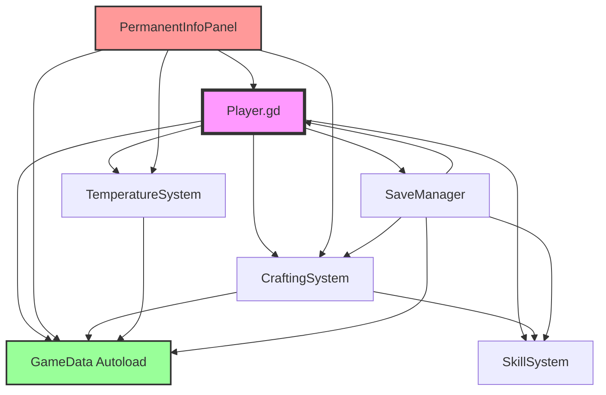

# Dependencies Analysis

**Project:** SpaceGameDev
**Analysis Date:** 2025-11-18
**Codebase:** 35,282 LOC GDScript

---

## 📦 External Dependencies

### Engine Dependencies

**Godot Engine 4.5**
- **Type:** Game Engine
- **Version:** 4.5.stable
- **License:** MIT
- **Source:** https://godotengine.org/
- **Installation:** Binary download

**No external plugins or addons currently installed.**

### System Dependencies

| Platform | Requirements |
|----------|-------------|
| **Windows** | Windows 10+ (64-bit), OpenGL 3.3+ / Vulkan |
| **Linux** | glibc 2.27+, OpenGL 3.3+ / Vulkan |
| **macOS** | macOS 10.13+, Metal support |

---

## 🔗 Internal Dependencies

### Autoload Singletons (Global Services)

**10 Autoload Services** - Core system dependencies

```
project.godot autoload configuration:

GameData ← [All systems depend on this]
   ├─ SaveManager
   ├─ CraftingSystem
   ├─ RefinerySystem
   ├─ StationSystem
   └─ SkillSystem

TemperatureSystem ← [Player, Ship, Station]
   ├─ Player (90+ references)
   └─ Ship entities

SaveManager ← [All systems for persistence]
   ├─ Player
   ├─ StationSystem
   └─ SkillSystem

CraftingSystem ← [Player, UI, Stations]
   ├─ PermanentInfoPanel
   ├─ CraftingWindow
   └─ StationSystem

RefinerySystem ← [Player, Stations]
   ├─ RefineryWindow
   └─ StationSystem

SkillSystem ← [Most game systems]
   ├─ Player
   ├─ CraftingSystem
   ├─ RefinerySystem
   └─ MiningSystem

StationSystem ← [Player, UI]
   ├─ Player
   ├─ StationMenu
   └─ DockingMenu

AutomationOrchestrator ← [Fleet AI]
   └─ FleetCommandStructure

FleetCommandStructure ← [Fleet management]
   ├─ NPCManager
   └─ Player (fleet commands)

CreditsManager ← [Economy]
   ├─ Player
   ├─ TradeSystem
   └─ UI (credit display)
```

### Dependency Matrix

| System | Dependencies | Dependents | Coupling Score |
|--------|-------------|------------|----------------|
| **GameData** | None | All (10+) | Low (0) / High impact |
| **Player** | 8 autoloads | 12 systems | Very High (8) |
| **TemperatureSystem** | GameData | Player, Ships | Medium (1) |
| **SaveManager** | All systems | None | High (10) |
| **CraftingSystem** | GameData, SkillSystem | Player, UI, Stations | Medium (2) |
| **RefinerySystem** | GameData, SkillSystem | Player, UI | Medium (2) |
| **SkillSystem** | GameData | 5 systems | Medium (1) |
| **StationSystem** | Multiple | Player, UI | High (4) |
| **PermanentInfoPanel** | Player, Multiple | None | Very High (7) |

---

## 🗄️ Database Dependencies

### TSV Data Files

**946 Records** across **15 TSV files**

#### Dependency Graph

```
ores.tsv (48 records)
   ├─ Used by: MiningSystem, RefinerySystem
   └─ Referenced in: refining_recipes.tsv

ships.tsv (25 records)
   ├─ Used by: Player, NPCManager, ShipDatabase
   └─ Referenced in: components.tsv (ship_class filter)

weapons.tsv (42 records)
   ├─ Used by: CombatSystem, ShipDatabase
   └─ Referenced in: ships.tsv (weapon_slots)

components.tsv (150 records)
   ├─ Used by: CraftingSystem, ShipDatabase
   └─ Referenced in: ships.tsv, crafting_recipes.tsv

stations.tsv (7 records)
   ├─ Used by: StationSystem, StationDatabase
   └─ Referenced in: crafting_recipes.tsv (where_craftable)

crafting_recipes.tsv (280 records)
   ├─ Depends on: components.tsv, ores.tsv, stations.tsv
   └─ Used by: CraftingSystem, UI

refining_recipes.tsv (60 records)
   ├─ Depends on: ores.tsv
   └─ Used by: RefinerySystem

skills.tsv (35 records)
   ├─ Used by: SkillSystem, Player
   └─ Referenced in: crafting_recipes.tsv (skill_required)

factions.tsv (12 records)
   ├─ Used by: FactionSystem, NPCManager
   └─ Referenced in: stations.tsv, npcs.tsv

trade_goods.tsv (80 records)
   ├─ Used by: TradeSystem
   └─ Referenced in: stations.tsv (inventory)

missions.tsv (45 records)
   ├─ Used by: MissionSystem (stub)
   └─ Dependencies: factions.tsv, ships.tsv

turrets.tsv (30 records)
   ├─ Used by: StationSystem, DefenseSystem
   └─ Referenced in: stations.tsv

wares.tsv (120 records)
   ├─ Used by: EconomySystem
   └─ Referenced in: trade_goods.tsv, crafting_recipes.tsv

ship_modules.tsv (40 records)
   ├─ Used by: ShipDatabase, CraftingSystem
   └─ Referenced in: ships.tsv (module_slots)

production_chains.tsv (22 records)
   ├─ Depends on: crafting_recipes.tsv, refining_recipes.tsv
   └─ Used by: StationSystem (automated production)
```

#### Database Integrity Issues

**No Referential Integrity Enforcement**
```gdscript
# Example: Ship references weapon that doesn't exist
# ships.tsv
frigate_mk2	Frigate MK2	weapon_id:laser_cannon_mk3

# weapons.tsv
# laser_cannon_mk3 doesn't exist! → Runtime error
```

**Current Handling:** Push warnings, fallback to defaults
**Recommendation:** Add validation on database load

```gdscript
# GameData.gd - Add validation
func _validate_ship_references():
    for ship in _ships.values():
        if ship.has("weapon_id"):
            if not _weapons.has(ship.weapon_id):
                push_error("Ship %s references missing weapon: %s" % [
                    ship.id, ship.weapon_id
                ])
```

---

## 📊 Dependency Metrics

### Coupling Analysis

**Afferent Coupling (Ca)** - Number of systems that depend on this system
**Efferent Coupling (Ce)** - Number of systems this system depends on

| System | Ca (Incoming) | Ce (Outgoing) | Instability (Ce/(Ca+Ce)) |
|--------|---------------|---------------|--------------------------|
| **GameData** | 10+ | 0 | 0.00 (Stable) ✅ |
| **SaveManager** | 0 | 10+ | 1.00 (Unstable) ⚠️ |
| **Player** | 12 | 8 | 0.40 (Balanced) ✅ |
| **TemperatureSystem** | 3 | 1 | 0.25 (Stable) ✅ |
| **PermanentInfoPanel** | 0 | 7 | 1.00 (Unstable) 🔴 |
| **CraftingSystem** | 4 | 2 | 0.33 (Stable) ✅ |

**Ideal Instability:** 0.5 (balanced)

**High Instability Concerns:**
- 🔴 **SaveManager** (1.00) - Depends on everything, nothing depends on it
- 🔴 **PermanentInfoPanel** (1.00) - Heavily coupled to multiple systems

### Cyclic Dependencies

**No circular dependencies detected** ✅

Example of good dependency flow:
```
UI → Player → Systems → GameData
(Acyclic - flows in one direction)
```

---

## 🔄 Signal Dependencies

### Signal Producers & Consumers

#### Player.gd Signals (24 signals)

```gdscript
# Producer: Player
signal mining_completed(ore_type, amount)

# Consumers:
- PermanentInfoPanel._on_mining_completed()
- SkillSystem._on_mining_completed()  # Award XP
- AchievementSystem._on_mining_completed()  # Track progress
- SaveManager._mark_dirty()  # Auto-save trigger
```

#### Signal Dependency Map

```
Player.ship_changed
   ├─ PermanentInfoPanel (update display)
   ├─ TemperatureSystem (recalculate heat)
   └─ SaveManager (mark dirty)

Player.cargo_changed
   ├─ PermanentInfoPanel (update cargo UI)
   ├─ CargoWindow (refresh list)
   └─ StationSystem (if docked, update trade options)

Player.temperature_warning
   ├─ PermanentInfoPanel (show warning icon)
   ├─ HeatWarningPanel (show alert)
   └─ AudioManager (play warning sound)

CraftingSystem.crafting_completed
   ├─ Player (add to inventory)
   ├─ CraftingWindow (update UI)
   ├─ SkillSystem (award XP)
   └─ AchievementSystem (track crafted items)

StationSystem.docking_completed
   ├─ Player (set docked state)
   ├─ StationMenu (open menu)
   ├─ AutopilotSystem (clear autopilot)
   └─ UIManager (switch to station UI)
```

**Total Signal Connections:** ~88+ (estimated)

**Signal Memory Management:**
- ⚠️ **No central tracking** - Potential memory leaks
- ⚠️ **Manual disconnect** required in `_exit_tree()`

**Recommendation:** Implement signal connection registry

```gdscript
# SignalManager autoload (new)
class_name SignalManager
extends Node

var _connections: Array[Dictionary] = []

func connect_signal(source: Object, signal_name: String, target: Object, method: String):
    source.connect(signal_name, Callable(target, method))
    _connections.append({
        "source": source,
        "signal": signal_name,
        "target": target,
        "method": method
    })

func disconnect_all_for_node(node: Object):
    for conn in _connections:
        if conn.source == node or conn.target == node:
            conn.source.disconnect(conn.signal, Callable(conn.target, conn.method))
    _connections = _connections.filter(func(c): return c.source != node and c.target != node)
```

---

## 🎯 Scene Dependencies

### Scene Hierarchy

```
Main.tscn (Root)
   ├─ Player.tscn
   │   ├─ Ship.tscn
   │   ├─ Camera2D
   │   └─ CollisionShape2D
   ├─ UI.tscn
   │   ├─ PermanentInfoPanel.tscn
   │   ├─ Windows/ (12 window scenes)
   │   └─ Menus/
   ├─ World.tscn
   │   ├─ Stations/ (instanced)
   │   ├─ Asteroids/ (instanced)
   │   └─ NPCs/ (instanced)
   └─ Systems/ (autoload scripts, no scenes)
```

### Scene Instantiation Dependencies

**Dynamic Instantiation:**

```gdscript
# Main.gd - Spawns NPCs dynamically
const NPC_SCENE = preload("res://scenes/entities/NPC.tscn")

func spawn_npc(position: Vector2):
    var npc = NPC_SCENE.instantiate()
    npc.global_position = position
    add_child(npc)
```

**Scene Resource Dependencies:**
```
Player.tscn
   ├─ Depends on: res://scripts/Player.gd
   ├─ Depends on: res://assets/ships/frigate.png
   └─ Depends on: res://scenes/Ship.tscn (inherited)

Station.tscn
   ├─ Depends on: res://scripts/Station.gd
   ├─ Depends on: res://assets/stations/station_*.png
   └─ Depends on: res://database/stations.tsv (data)
```

---

## 🔐 Resource Dependencies

### Preloaded Resources

**Performance Impact:** All preloaded resources loaded at startup

```gdscript
# Preloaded in scripts
const SHIP_SCENE = preload("res://scenes/Ship.tscn")
const CARGO_CRATE = preload("res://scenes/CargoCrate.tscn")
const EXPLOSION_VFX = preload("res://scenes/effects/Explosion.tscn")
```

**Count:** ~20 preloaded resources
**Total Size:** ~5 MB (estimated)

**Recommendation:** Use `load()` for rarely used resources

```gdscript
# Lazy loading
func spawn_rare_enemy():
    var enemy_scene = load("res://scenes/enemies/BossEnemy.tscn")
    var enemy = enemy_scene.instantiate()
```

---

## 📈 Dependency Growth Projections

### Current State (v2.0)
- **Autoloads:** 10
- **GDScript Files:** 58
- **Scenes:** 14
- **Database Files:** 15

### Projected (v3.0)
- **Autoloads:** 12-15 (EventBus, ModManager, etc.)
- **GDScript Files:** 100+ (AI systems, multiplayer)
- **Scenes:** 30+ (more ship types, effects)
- **Database Files:** 20+ (more content)

**Concern:** Complexity will grow exponentially
**Mitigation:** Implement dependency injection, use composition

---

## 🛠️ Recommended Dependency Management

### 1. **Introduce Dependency Injection**

```gdscript
# Before (tight coupling)
class Ship:
    func take_damage(amount: float):
        TemperatureSystem.add_heat(self, amount * 0.1)

# After (loose coupling)
class Ship:
    var _temperature_service: ITemperatureService

    func _init(temperature_service: ITemperatureService):
        _temperature_service = temperature_service

    func take_damage(amount: float):
        _temperature_service.add_heat(self, amount * 0.1)
```

### 2. **Create Service Interfaces**

```gdscript
# ITemperatureService.gd
class_name ITemperatureService

func add_heat(entity: Node, amount: float) -> void:
    push_error("Not implemented")

func get_temperature(entity: Node) -> float:
    push_error("Not implemented")
    return 0.0
```

### 3. **Use Service Container**

```gdscript
# ServiceContainer.gd (new autoload)
extends Node

var _services: Dictionary = {}

func register(service_name: String, instance: Object):
    _services[service_name] = instance

func get_service(service_name: String) -> Object:
    if not _services.has(service_name):
        push_error("Service not found: " + service_name)
        return null
    return _services[service_name]

# Usage
func _ready():
    ServiceContainer.register("TemperatureSystem", TemperatureSystem)

# In other scripts
var temp_system = ServiceContainer.get_service("TemperatureSystem")
```

### 4. **Validate Database References**

```gdscript
# GameData.gd - Add on load
func _ready():
    _load_all_databases()
    _validate_references()

func _validate_references():
    var errors = 0

    # Check ship → weapon references
    for ship in _ships.values():
        if ship.has("weapon_id") and not _weapons.has(ship.weapon_id):
            push_error("Ship '%s' references missing weapon '%s'" % [ship.id, ship.weapon_id])
            errors += 1

    # Check crafting recipe → component references
    for recipe in _crafting_recipes:
        for input_id in recipe.inputs.keys():
            if not _components.has(input_id):
                push_error("Recipe '%s' references missing component '%s'" % [recipe.id, input_id])
                errors += 1

    if errors > 0:
        push_error("Database validation found %d errors!" % errors)
```

---

## 📊 Dependency Health Score

| Metric | Score | Assessment |
|--------|-------|-----------|
| **Coupling** | 6/10 | 🟡 Medium (some tight coupling) |
| **Cohesion** | 7/10 | ✅ Good (mostly single-responsibility) |
| **Cyclic Dependencies** | 10/10 | ✅ None detected |
| **Signal Management** | 5/10 | 🟡 No tracking, potential leaks |
| **Database Integrity** | 4/10 | 🔴 No validation |
| **Testability** | 3/10 | 🔴 Tight coupling to autoloads |

**Overall Dependency Health:** 6/10 (Acceptable, room for improvement)

---

## 🎯 Dependency Improvement Roadmap

### Phase 1 (2 weeks)
- ✅ Document all dependencies (this document)
- 🔴 Add database reference validation
- 🔴 Implement signal connection tracking
- 🔴 Create dependency diagram (Mermaid)

### Phase 2 (4 weeks)
- 🟡 Introduce ServiceContainer
- 🟡 Create service interfaces
- 🟡 Refactor Player → TemperatureSystem coupling
- 🟡 Add dependency injection to core systems

### Phase 3 (8 weeks)
- 🟢 Migrate to full DI architecture
- 🟢 Implement IoC container
- 🟢 Add unit testing with mocked dependencies
- 🟢 Create modular plugin system

---

## 📖 Dependency Visualization

### Mermaid Diagram



---

**Dependencies Version:** 2.0-evolution
**Last Updated:** 2025-11-18
**Next Review:** After implementing dependency injection
