# Feature Chains & Dependencies

**Project:** SpaceGameDev
**Analysis Date:** 2025-11-18
**Purpose:** Document feature dependencies and implementation order

---

## 📊 Overview

This document maps **feature chains** - sequences of features where implementing Feature X automatically requires or triggers implementation of Features Y, Z, A, B.

**Key Principle:** When you implement a feature, implement ALL its dependencies immediately to avoid incomplete functionality.

---

## 🔗 Feature Dependency Graph

```mermaid
graph TD
    A[Player Ship] --> B[Movement System]
    A --> C[Input Handling]
    A --> D[Camera System]

    B --> E[Autopilot]
    B --> F[Collision Detection]

    E --> G[Pathfinding]
    E --> H[Navigation]
    E --> I[Obstacle Avoidance]

    A --> J[Cargo System]
    J --> K[Inventory Management]
    J --> L[Cargo UI]
    J --> M[Weight/Volume Limits]

    A --> N[Mining System]
    N --> J
    N --> O[Mining Laser]
    N --> P[Ore Detection]
    N --> Q[Mining UI]

    J --> R[Crafting System]
    R --> S[Recipe Management]
    R --> T[Skill Checks]
    R --> U[Crafting UI]
    R --> V[Quality System]

    R --> W[Refinery System]
    W --> X[Refining Recipes]
    W --> T
    W --> Y[Refinery UI]

    A --> Z[Temperature System]
    Z --> AA[Heat Sources]
    Z --> AB[Cooling Sources]
    Z --> AC[Temperature UI]
    Z --> AD[Damage System]

    A --> AE[Energy System]
    AE --> AF[Power Generation]
    AE --> AG[Power Consumption]
    AE --> AH[Energy UI]

    A --> AI[Combat System]
    AI --> AJ[Weapons System]
    AI --> AK[Targeting System]
    AI --> AL[Damage Calculation]
    AI --> AM[Combat UI]

    AI --> AN[Combat AI]
    AN --> AO[Behavior Trees]
    AN --> AP[Target Selection]
    AN --> AQ[Attack Patterns]

    A --> AR[Station System]
    AR --> AS[Docking]
    AR --> AT[Station Services]
    AR --> R
    AR --> W
    AR --> AU[Trade UI]

    AT --> AV[Trade System]
    AV --> AW[Trade AI]
    AW --> AX[Route Finding]
    AW --> AY[Price Calculation]

    A --> AZ[Fleet System]
    AZ --> BA[Squadron Management]
    AZ --> BB[Command Structure]
    AZ --> BC[Fleet UI]

    BB --> AN
    BB --> AW

    A --> BD[Diplomacy System]
    BD --> BE[Faction System]
    BD --> BF[Reputation]
    BD --> BG[Diplomatic Actions]

    BE --> BH[Faction AI]
    BE --> BI[Warfare System]

    A --> BJ[Mission System]
    BJ --> BK[Mission Types]
    BJ --> BL[Mission Generation]
    BJ --> BM[Mission Tracking]
    BJ --> BN[Mission UI]

    BK --> AN
    BK --> AW
    BK --> N
```



---

## 🎯 Critical Feature Chains

### Chain 1: Targeting System → Context Menu → Scanner
**Impact:** Game-breaking if incomplete

```
TARGETING SYSTEM (missing!)
├─ Player.target_object(obj: Node)
├─ Player.get_targeted_object() -> Node
└─ Player.clear_target()
    │
    ├─→ CONTEXT MENU (blocked)
    │   ├─ Main.gd:322, 345 calls get_targeted_object()
    │   ├─ Show options for targeted object
    │   └─ Attack/Dock/Mine/Scan options
    │
    ├─→ SCANNER PANEL (incomplete)
    │   ├─ PermanentInfoPanel.gd:239, 267, 327
    │   ├─ Display target info
    │   └─ Show target stats
    │
    └─→ TARGETING UI (exists but not connected!)
        ├─ TargetingPanel.gd (167 LOC)
        ├─ Distance indicator
        └─ Target name/type display
```

**Implementation Order:**
1. **FIRST:** Implement targeting methods in Player.gd (30 min)
2. **SECOND:** Connect TargetingPanel to signals (15 min)
3. **THIRD:** Connect context menu to targeting (30 min)
4. **FOURTH:** Connect scanner to targeting (15 min)

**Total Time:** 1.5 hours
**Status:** 🔴 CRITICAL - Must implement immediately

---

### Chain 2: Temperature System → UI Warnings → Damage
**Impact:** Gameplay feedback missing

```
TEMPERATURE SYSTEM (90% complete)
├─ TemperatureSystem autoload ✅
├─ Heat tracking ✅
├─ Cooling tracking ✅
└─ Threshold detection ✅
    │
    ├─→ UI WARNINGS (missing!)
    │   ├─ Player.gd:816-843 (TODOs)
    │   ├─ TemperatureWarningPanel (doesn't exist)
    │   ├─ Warning sounds (missing)
    │   └─ Visual flash (missing)
    │       │
    │       └─→ PLAYER NOTIFICATION
    │           ├─ Yellow warning (60-80°C)
    │           ├─ Orange warning (80-90°C)
    │           └─ Red critical (90-100°C)
    │
    └─→ HEAT DAMAGE (incomplete)
        ├─ Player._on_temperature_critical() stub
        ├─ Damage calculation (missing)
        ├─ System failures (missing)
        └─ Visual effects (missing)
```

**Implementation Order:**
1. **FIRST:** Create TemperatureWarningPanel.gd + .tscn (1h)
2. **SECOND:** Implement Player signal handlers (30 min)
3. **THIRD:** Add warning sounds (15 min)
4. **FOURTH:** Implement heat damage (30 min)
5. **FIFTH:** Add visual effects (15 min)

**Total Time:** 2.5 hours
**Status:** 🟡 HIGH - Gameplay feedback

---

### Chain 3: Error Handling → Logging → User Feedback
**Impact:** Stability and debugging

```
ERROR HANDLING (0.1% coverage)
├─ Add validation checks
├─ Return error codes
└─ Handle edge cases
    │
    ├─→ STRUCTURED LOGGING (missing)
    │   ├─ Logger autoload
    │   ├─ Log levels (DEBUG, INFO, WARNING, ERROR)
    │   ├─ Category filtering
    │   └─ File logging
    │       │
    │       └─→ DEBUG TOOLS
    │           ├─ Performance profiling
    │           ├─ Error tracking
    │           └─ Analytics
    │
    └─→ USER FEEDBACK
        ├─ Error messages (user-friendly)
        ├─ Notification system
        └─ Error recovery hints
```

**Implementation Order:**
1. **FIRST:** Create Logger autoload (1h)
2. **SECOND:** Add error handling to CraftingSystem (2h)
3. **THIRD:** Add error handling to SaveManager (2h)
4. **FOURTH:** Add error handling to all systems (6h)
5. **FIFTH:** Replace debug prints with Logger (2h)
6. **SIXTH:** Create NotificationManager (2h)

**Total Time:** 15 hours
**Status:** 🔴 CRITICAL - Prevents crashes

---

### Chain 4: Testing Framework → Tests → CI/CD
**Impact:** Code quality and regression prevention

```
TESTING FRAMEWORK (missing)
├─ Install GUT plugin
├─ Configure test runner
└─ Create test structure
    │
    ├─→ UNIT TESTS
    │   ├─ CraftingSystem tests (8h)
    │   ├─ SaveManager tests (6h)
    │   ├─ TemperatureSystem tests (4h)
    │   ├─ SkillSystem tests (4h)
    │   └─ Others (10h)
    │       │
    │       └─→ MOCKS & FIXTURES
    │           ├─ MockGameData
    │           ├─ MockPlayer
    │           └─ Test fixtures
    │
    ├─→ INTEGRATION TESTS
    │   ├─ Mining workflow (2h)
    │   ├─ Crafting pipeline (2h)
    │   └─ Save/Load cycle (2h)
    │
    └─→ CI/CD PIPELINE
        ├─ GitHub Actions
        ├─ Automated test runs
        ├─ Coverage reports
        └─ Deployment automation
```

**Implementation Order:**
1. **FIRST:** Install GUT (1h)
2. **SECOND:** Write first test (CraftingSystem) (2h)
3. **THIRD:** Create mock classes (2h)
4. **FOURTH:** Write core system tests (20h)
5. **FIFTH:** Set up CI/CD (4h)

**Total Time:** 29 hours
**Status:** 🔴 CRITICAL - Required for refactoring

---

### Chain 5: PermanentInfoPanel → Split Panels → Signals
**Impact:** Maintainability and performance

```
PERMANENT INFO PANEL (1,217 LOC monolith)
├─ Too many responsibilities
├─ Hard to maintain
└─ Performance issues
    │
    ├─→ SPLIT INTO COMPONENTS
    │   ├─ ShipStatsPanel (200 LOC)
    │   ├─ CargoPanel (300 LOC)
    │   ├─ TemperaturePanel (150 LOC)
    │   ├─ EnergyPanel (150 LOC)
    │   ├─ ScannerPanel (250 LOC)
    │   └─ TargetingPanel (167 LOC) ✅ exists
    │       │
    │       └─→ SIGNAL-DRIVEN UPDATES
    │           ├─ Update only on change
    │           ├─ No 60x/second polling
    │           └─ Better performance
    │
    └─→ PANEL MANAGER
        ├─ Coordinates panels
        ├─ Layout management
        └─ Visibility toggling
```

**Implementation Order:**
1. **FIRST:** Create ShipStatsPanel (3h)
2. **SECOND:** Create CargoPanel (4h)
3. **THIRD:** Create TemperaturePanel (2h)
4. **FOURTH:** Create EnergyPanel (2h)
5. **FIFTH:** Create ScannerPanel (3h)
6. **SIXTH:** Connect TargetingPanel (1h)
7. **SEVENTH:** Update Main scene layout (1h)
8. **EIGHTH:** Delete old PermanentInfoPanel (30 min)

**Total Time:** 16.5 hours
**Status:** 🟡 HIGH - Code quality

---

### Chain 6: Save Encryption → Validation → Migration
**Impact:** Security and data integrity

```
SAVE SYSTEM (unencrypted)
├─ Plain JSON files
├─ No validation
└─ No versioning
    │
    ├─→ ENCRYPTION
    │   ├─ FileAccess.open_encrypted_with_pass()
    │   ├─ AES-256 encryption
    │   └─ Secure password storage
    │       │
    │       ├─→ CHECKSUM VALIDATION
    │       │   ├─ SHA-256 hash
    │       │   ├─ Detect tampering
    │       │   └─ Corruption detection
    │       │
    │       └─→ ANTI-CHEAT
    │           ├─ ProtectedValue class
    │           ├─ Critical data protection
    │           └─ Integrity checks
    │
    └─→ VERSION MIGRATION
        ├─ Version field in saves
        ├─ Migration functions
        └─ Backward compatibility
```

**Implementation Order:**
1. **FIRST:** Implement encrypted save/load (2h)
2. **SECOND:** Add checksum validation (1h)
3. **THIRD:** Create ProtectedValue class (1h)
4. **FOURTH:** Add version migration (1h)
5. **FIFTH:** Migrate existing saves (30 min)

**Total Time:** 5.5 hours
**Status:** 🔴 CRITICAL - Security

---

### Chain 7: Combat AI → Behavior Trees → LimboAI
**Impact:** Gameplay completeness

```
COMBAT AI (stub - 70 LOC)
├─ No combat logic
├─ No target selection
└─ No attack patterns
    │
    ├─→ LIMBOAI PLUGIN
    │   ├─ Install plugin
    │   ├─ Learn behavior tree syntax
    │   └─ Create BT library
    │       │
    │       └─→ BEHAVIOR TREES
    │           ├─ Target selection BT
    │           ├─ Attack pattern BT
    │           ├─ Evasion BT
    │           ├─ Flee BT
    │           └─ Formation BT
    │
    ├─→ COMBAT ACTIONS
    │   ├─ Fire weapons
    │   ├─ Aim at target
    │   ├─ Dodge projectiles
    │   └─ Maintain distance
    │
    └─→ COMBAT TUNING
        ├─ Difficulty levels
        ├─ Balance testing
        └─ AI personality variants
```

**Implementation Order:**
1. **FIRST:** Install LimboAI (1h)
2. **SECOND:** Design behavior trees (3h)
3. **THIRD:** Implement target selection (2h)
4. **FOURTH:** Implement attack patterns (4h)
5. **FIFTH:** Implement evasion (3h)
6. **SIXTH:** Implement flee logic (2h)
7. **SEVENTH:** Balance tuning (6h)

**Total Time:** 21 hours
**Status:** 🟡 MEDIUM - Feature completeness

---

### Chain 8: Trade AI → Route Finding → Economy Simulation
**Impact:** Economic gameplay depth

```
TRADE AI (stub - 60 LOC)
├─ No route finding
├─ No profit calculation
└─ No trading logic
    │
    ├─→ ROUTE FINDING
    │   ├─ Find stations
    │   ├─ Calculate distances
    │   ├─ Pathfinding
    │   └─ Multi-stop routes
    │       │
    │       └─→ PROFIT CALCULATION
    │           ├─ Buy/sell prices
    │           ├─ Transport costs
    │           ├─ Time value
    │           └─ Risk assessment
    │
    ├─→ TRADING EXECUTION
    │   ├─ Buy goods
    │   ├─ Sell goods
    │   ├─ Navigate routes
    │   └─ Cargo management
    │
    └─→ ECONOMY SIMULATION
        ├─ Supply and demand
        ├─ Price fluctuations
        ├─ Market events
        └─ Trade opportunities
```

**Implementation Order:**
1. **FIRST:** Implement route finding (4h)
2. **SECOND:** Profit calculation (3h)
3. **THIRD:** Trading execution (3h)
4. **FOURTH:** Supply/demand simulation (6h)
5. **FIFTH:** Price fluctuations (3h)
6. **SIXTH:** Market events (3h)

**Total Time:** 22 hours
**Status:** 🟡 MEDIUM - Gameplay depth

---

### Chain 9: Diplomacy → Factions → Warfare
**Impact:** Strategic gameplay layer

```
DIPLOMACY SYSTEM (stub - 90 LOC)
├─ No relationship tracking
├─ No diplomatic actions
└─ No consequences
    │
    ├─→ FACTION SYSTEM
    │   ├─ Faction definitions
    │   ├─ Territory ownership
    │   ├─ Faction assets
    │   └─ Faction goals
    │       │
    │       ├─→ REPUTATION SYSTEM
    │       │   ├─ Standing calculation
    │       │   ├─ Relationship modifiers
    │       │   ├─ Action consequences
    │       │   └─ Reputation UI
    │       │
    │       └─→ DIPLOMATIC ACTIONS
    │           ├─ Trade agreements
    │           ├─ Alliances
    │           ├─ Declarations of war
    │           └─ Peace treaties
    │
    └─→ FACTION WARFARE
        ├─ Territory conquest
        ├─ Fleet battles
        ├─ Economic warfare
        └─ Diplomatic victory
```

**Implementation Order:**
1. **FIRST:** Implement faction system (8h)
2. **SECOND:** Reputation tracking (6h)
3. **THIRD:** Diplomatic actions (8h)
4. **FOURTH:** Faction warfare (12h)
5. **FIFTH:** Balance and tuning (6h)

**Total Time:** 40 hours
**Status:** 🟢 LOW - Advanced feature

---

### Chain 10: Mission System → Generation → Rewards
**Impact:** Content depth and replayability

```
MISSION SYSTEM (stub - 400 LOC framework)
├─ No mission types
├─ No generation logic
└─ No tracking
    │
    ├─→ MISSION TYPES
    │   ├─ Delivery missions
    │   ├─ Combat missions
    │   ├─ Mining missions
    │   ├─ Exploration missions
    │   └─ Escort missions
    │       │
    │       └─→ MISSION GENERATION
    │           ├─ Procedural generation
    │           ├─ Faction-specific missions
    │           ├─ Difficulty scaling
    │           └─ Mission chains
    │
    ├─→ MISSION TRACKING
    │   ├─ Active missions
    │   ├─ Progress tracking
    │   ├─ Objective updates
    │   └─ Completion detection
    │
    └─→ REWARD SYSTEM
        ├─ Credit rewards
        ├─ Item rewards
        ├─ Reputation rewards
        └─ Unlock rewards
```

**Implementation Order:**
1. **FIRST:** Define mission types (4h)
2. **SECOND:** Implement mission generation (8h)
3. **THIRD:** Mission tracking (6h)
4. **FOURTH:** Reward calculation (4h)
5. **FIFTH:** Mission UI (8h)
6. **SIXTH:** Create 50+ mission templates (8h)

**Total Time:** 38 hours
**Status:** 🟢 LOW - Content feature

---

## 🎯 Implementation Priority Matrix

### Phase 1: Critical Fixes (Weeks 1-2)

```
Priority 1 (Blocking)
├─ Chain 1: Targeting System (1.5h)
├─ Chain 3: Error Handling (15h)
├─ Chain 6: Save Encryption (5.5h)
└─ Chain 2: Temperature UI (2.5h)

Total: 24.5 hours
```

### Phase 2: Quality & Performance (Weeks 3-6)

```
Priority 2 (High Impact)
├─ Chain 4: Testing Framework (29h)
├─ Chain 5: PermanentInfoPanel Split (16.5h)
├─ Lazy Database Loading (4h)
└─ Logger Migration (2h)

Total: 51.5 hours
```

### Phase 3: Features (Weeks 7-16)

```
Priority 3 (Gameplay)
├─ Chain 7: Combat AI (21h)
├─ Chain 8: Trade AI (22h)
├─ Chain 9: Diplomacy (40h)
└─ Chain 10: Mission System (38h)

Total: 121 hours
```

---

## 📊 Feature Dependency Matrix

| Feature | Depends On | Blocks | Priority |
|---------|-----------|--------|----------|
| **Targeting System** | Player | Context Menu, Scanner | 🔴 P0 |
| **Temperature UI** | TemperatureSystem | Heat Damage | 🔴 P0 |
| **Error Handling** | - | Testing, Refactoring | 🔴 P0 |
| **Save Encryption** | SaveManager | Security | 🔴 P0 |
| **Logger** | - | Error Handling, Debugging | 🔴 P0 |
| **GUT Framework** | - | All Tests | 🔴 P0 |
| **Panel Refactor** | Signals | Performance, Maintainability | 🟡 P1 |
| **Combat AI** | LimboAI, Targeting | Missions | 🟡 P1 |
| **Trade AI** | Route Finding, Economy | Missions | 🟡 P1 |
| **Diplomacy** | Factions | Warfare, Missions | 🟢 P2 |
| **Missions** | AI Systems, Economy | Content Depth | 🟢 P2 |

---

## 🔄 Triggering Features

**Rule:** When implementing Feature X, automatically implement Features Y, Z, A, B

### Targeting System → Triggers:
- ✅ TargetingPanel connection
- ✅ Context menu integration
- ✅ Scanner info display
- ✅ Attack command integration

### Combat AI → Triggers:
- ✅ LimboAI installation
- ✅ Behavior tree library
- ✅ Combat balancing
- ✅ AI personality system
- ✅ Formation flying

### Trade AI → Triggers:
- ✅ Route finding algorithm
- ✅ Profit calculator
- ✅ Supply/demand simulation
- ✅ Market fluctuations
- ✅ Trade route visualization

### Diplomacy → Triggers:
- ✅ Faction system enhancement
- ✅ Reputation tracking
- ✅ Diplomatic UI
- ✅ Faction warfare mechanics
- ✅ Territory management

### Mission System → Triggers:
- ✅ Mission types (5+)
- ✅ Procedural generation
- ✅ Mission UI
- ✅ Reward calculator
- ✅ Mission chains
- ✅ 50+ mission templates

---

## 💡 Best Practices

### 1. **Complete the Chain**
When starting a feature, implement ALL dependencies first.

❌ **Bad:** Implement targeting system, leave context menu for later
✅ **Good:** Implement targeting + context menu + scanner + UI in one session

### 2. **Test Each Link**
Test each dependency individually before moving to next.

✅ Write test for targeting system
✅ Test context menu integration
✅ Test scanner info display
✅ Integration test for complete chain

### 3. **Document Dependencies**
Update this document when adding new features.

```gdscript
## New Feature: Autopilot Waypoints
## Depends on: Autopilot, Pathfinding
## Triggers: Route visualization, Waypoint UI, Route saving
## Estimated: 4 hours
```

### 4. **Use Feature Flags**
Incomplete features should be hidden behind flags.

```gdscript
const FEATURE_DIPLOMACY_ENABLED = false  # Set to true when complete

func _ready():
    if FEATURE_DIPLOMACY_ENABLED:
        _initialize_diplomacy_system()
```

---

## 📖 Feature Chain Template

Use this template when planning new features:

```markdown
### Chain X: [Feature Name] → [Triggered Features]
**Impact:** [Gameplay/Technical/Business impact]

FEATURE NAME (status)
├─ Dependency 1
├─ Dependency 2
└─ Dependency 3
    │
    ├─→ TRIGGERED FEATURE A
    │   ├─ Sub-feature 1
    │   ├─ Sub-feature 2
    │   └─ Sub-feature 3
    │       │
    │       └─→ CASCADING FEATURE
    │           └─ More sub-features
    │
    └─→ TRIGGERED FEATURE B
        └─ Implementation details

**Implementation Order:**
1. Step 1 (time)
2. Step 2 (time)
3. Step 3 (time)

**Total Time:** X hours
**Status:** Priority level
```

---

**Feature Chains Version:** 2.0-evolution
**Last Updated:** 2025-11-18
**Next Review:** When adding major features
**Document Owner:** Development Team
